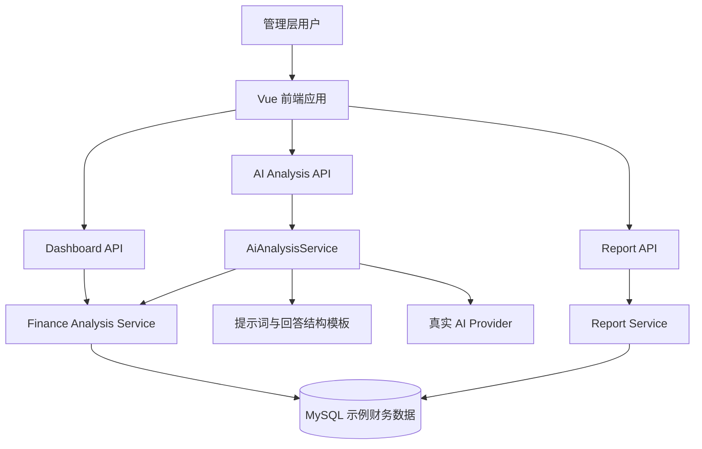

# AI 企业财务经营数据分析决策平台设计文档

## 1. 背景与目标

本项目建设一个面向企业管理层的 AI 财务经营数据分析决策平台。第一版聚焦财务经营分析，以内置示例数据支撑完整演示体验，帮助用户快速理解企业收入、成本、利润、现金流和预算偏差情况，并通过 AI 分析能力生成经营洞察与决策建议。

第一版不是正式财务审计系统，也不处理真实企业数据导入。它的核心目标是验证产品体验、信息架构、财务分析逻辑和 AI 决策辅助价值，为后续接入真实 Excel/CSV、ERP、财务系统和大模型 API 留出清晰扩展路径。

## 2. 技术栈

- 后端：Spring Boot
- 前端：Vue
- 数据库：MySQL
- AI 策略：MVP 直接接入 DeepSeek 真实 AI；后端保留可插拔 `AiProvider` 接口，默认使用 OpenAI-compatible HTTP Provider。默认配置为 `base_url=https://api.deepseek.com`、`model=deepseek-v4-pro`、`api_key=DEEPSEEK_API_KEY` 环境变量，并在请求中启用 high reasoning 与 thinking。

## 2.1 补充实现规范

- 所有金额字段和财务计算必须使用 BigDecimal。
- 金额单位统一为万元。
- 百分比由后端计算并统一保留 2 位小数。
- 后端负责财务计算，前端只负责展示。
- 风险等级统一为 LOW、MEDIUM、HIGH。
- 风险类型统一为 CASH_FLOW_RISK、PROFIT_MARGIN_DROP、COST_GROWTH_FAST、BUDGET_OVERSPEND、REVENUE_DECLINE。
- AI 回答统一包含结论、数据依据、原因分析、风险提示、建议动作。
- 系统视觉采用企业级 SaaS 数据分析平台风格，使用左侧菜单、顶部标题栏、卡片式布局和 ECharts 图表，主色调为深蓝、科技蓝、白色和浅灰。

## 3. 目标用户

### CEO / 企业老板

关注公司整体经营状态，需要快速看到收入增长、利润变化、现金流风险和关键经营问题。

### 财务负责人

关注财务指标、预算执行、成本结构、利润率变化和异常解释，需要辅助生成管理层汇报材料。

### 经营分析师

关注多维度指标拆解、趋势分析、问题定位和建议输出，需要用数据支持经营讨论。

## 4. MVP 范围

### 包含

- 管理层财务驾驶舱
- 收入、成本、毛利、净利、经营现金流核心指标
- 月度趋势分析
- 预算值与实际值对比
- 预算偏差解释
- 现金流风险提示
- AI 经营摘要
- AI 财务问答
- AI 决策建议
- 结构化经营分析报告生成
- 内置示例财务数据

### 暂不包含

- 用户登录与权限
- 多租户企业管理
- Excel/CSV 上传
- ERP 或财务系统对接
- 在线支付或订阅
- 正式审计级财务校验
- 复杂 BI 自定义报表设计器

这些能力属于后续阶段，不进入第一版 MVP。

## 5. 产品形态

第一版采用“驾驶舱优先”的融合形态。用户打开系统后首先进入财务驾驶舱，立即看到企业经营状态、风险提醒和 AI 摘要，再从驾驶舱进入问答、报告、预算偏差解释等模块。

核心页面如下：

- 首页驾驶舱：展示关键 KPI、趋势图、风险提醒、AI 摘要。
- AI 分析页：支持自然语言提问，并返回基于示例数据的解释。
- 经营报告页：选择月份或季度后生成结构化财务经营分析报告。
- 预算偏差页：展示预算值、实际值、偏差金额、偏差率和解释。
- 数据说明页：说明示例数据范围、口径和限制。

## 6. 核心用户流程

1. 用户进入首页驾驶舱。
2. 系统展示收入、成本、利润、现金流和预算执行情况。
3. 用户查看 AI 自动生成的本期经营摘要。
4. 用户点击异常指标，例如净利率下降或现金流承压。
5. 系统展示指标趋势、预算偏差和可能原因。
6. 用户进入 AI 问答页，询问“为什么本月利润下降？”。
7. 系统基于示例数据返回原因拆解、风险提示和建议。
8. 用户生成月度经营分析报告，用于管理层会议讨论。

## 7. 数据设计

第一版使用 MySQL 存储内置示例数据。数据通过 SQL 初始化脚本在系统启动时写入，便于后端 API 统一读取和分析。示例数据覆盖最近 12 个月，必须包含收入、成本、毛利、净利、经营现金流、预算值和业务线数据，并至少包含一次成本异常增长、一次现金流转负、一次预算超支、一次利润率下降。

### 核心表建议

#### finance_period

用于定义财务期间。

- id
- year
- month
- quarter
- period_label

#### finance_metric

用于存储财务指标实际值。

- id
- period_id
- metric_code
- metric_name
- metric_category
- actual_value
- unit

#### finance_budget

用于存储预算值。

- id
- period_id
- metric_code
- budget_value
- unit

#### business_line_metric

用于存储业务线维度指标。

- id
- period_id
- business_line
- revenue
- cost
- gross_profit
- net_profit

### 指标口径

- 收入：企业当期主营业务收入。
- 成本：与收入直接相关的主营业务成本。
- 毛利：收入减成本。
- 净利：扣除经营费用后的利润。
- 毛利率：毛利除以收入。
- 净利率：净利除以收入。
- 经营现金流：经营活动产生的现金流量净额。
- 预算偏差：实际值减预算值。
- 预算偏差率：预算偏差除以预算值。

## 8. 后端模块设计

### Dashboard API

负责提供首页驾驶舱数据。

主要接口：

- GET /api/dashboard/overview
- GET /api/dashboard/trends
- GET /api/dashboard/risks

### Finance Analysis Service

负责财务指标计算、趋势分析、预算偏差计算和风险识别。

核心能力：

- 汇总指定期间的财务指标
- 计算同比或环比变化
- 计算预算偏差
- 识别净利率下降、现金流为负、成本增速高于收入增速等风险

### AI Analysis Service

负责 AI 摘要、问答、解释和建议生成。MVP 直接调用真实 AI，使用提示词模板约束回答结构，接口设计保持可替换。

核心能力：

- 生成经营摘要
- 回答常见财务问题
- 解释预算偏差
- 生成降本增收建议
- 输出现金流风险提示

后续更换模型供应商时，可以在不改变前端和业务服务调用方式的前提下替换 `AiProvider` 实现。

### Report Service

负责生成结构化经营分析报告。

报告包含：

- 本期经营概览
- 收入分析
- 成本分析
- 利润分析
- 现金流分析
- 预算执行分析
- 主要风险
- 决策建议

## 9. 前端模块设计

### 首页驾驶舱

展示内容：

- KPI 卡片：收入、成本、毛利、净利、经营现金流、预算完成率
- 趋势图：收入、成本、净利、现金流月度趋势
- 风险提醒：现金流承压、利润率下降、成本异常增长
- AI 摘要：用自然语言总结本期经营情况
- 快捷入口：问 AI、生成报告、查看预算偏差

### AI 分析页

展示内容：

- 问题输入框
- 常见问题快捷按钮
- AI 回答结果
- 关联指标引用
- 建议动作

常见问题示例：

- 为什么本月利润下降？
- 哪项成本增长最快？
- 现金流是否存在风险？
- 本月预算执行情况如何？
- 有哪些降本增收建议？

### 经营报告页

展示内容：

- 期间选择
- 报告生成按钮
- 结构化报告内容
- 重点风险与建议

### 预算偏差页

展示内容：

- 指标维度预算偏差表
- 偏差金额和偏差率
- 正向/负向偏差标记
- AI 偏差解释

## 10. AI 能力边界

MVP 的 AI 输出基于内置示例数据和真实 AI 推理，但不应宣称为真实财务顾问、审计结论或投资建议。

AI 回答应遵循以下原则：

- 统一包含结论、数据依据、原因分析、风险提示、建议动作。
- 明确引用相关指标和期间。
- 对异常变化给出数据依据。
- 建议应可执行，例如控制成本、优化回款、复盘预算假设。
- 遇到示例数据无法支持的问题，应说明当前数据不足。
- 不编造不存在的数据来源。

## 11. 推荐系统架构

## 12. 错误处理

- 数据为空：展示空状态，并说明当前期间无示例数据。
- 指标计算异常：后端返回明确错误码，前端展示友好提示。
- AI 问题无法回答：返回“当前示例数据不足以回答该问题”，并推荐可回答的问题。
- 数据库连接失败：后端记录日志，前端展示系统暂不可用。
- 真实 AI 接入失败：后端返回明确错误，前端展示 AI 服务暂不可用，不伪造分析结论。

## 13. 测试策略

### 后端测试

- 财务指标计算单元测试
- 预算偏差计算测试
- 风险识别规则测试
- AI Provider 请求与响应解析测试
- API 响应结构测试

### 前端测试

- 驾驶舱核心数据渲染
- 趋势图和 KPI 状态展示
- AI 问答提交与结果展示
- 报告生成流程
- 预算偏差表展示

### 验收测试

- 用户能在 30 秒内理解公司经营状态。
- 系统能解释净利下降、成本增长和现金流风险。
- 系统能生成一份结构清晰的月度经营分析报告。
- AI 问答结果与示例数据一致。
- 后端 AI 服务接口具备替换模型供应商的扩展点。

## 14. 后续扩展方向

- Excel/CSV 上传与字段映射
- 多模型路由与高级 AI Agent
- 用户登录与角色权限
- 多企业多账套支持
- ERP/财务系统对接
- 自定义指标和报表
- PDF/Word 报告导出
- 数据权限和审计日志

## 15. 非目标

第一版不追求成为完整财务软件、BI 平台或审计系统。它应聚焦“让管理层快速看懂经营状态，并通过 AI 获得解释和建议”这一核心价值。
